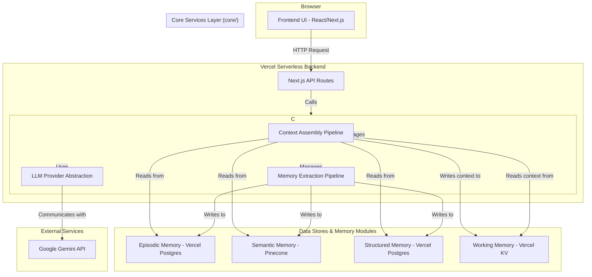

# SoulyCore v2: System Architecture

**Document Version:** 2.0
**Status:** Live

---

### 1. High-Level Architecture Diagram

The v2 architecture introduces a dedicated `core/` services layer that decouples the frontend and API routes from the underlying memory and AI model logic. This promotes modularity, testability, and maintainability.

### 2. Key Architectural Layers

1.  **Frontend UI (`components/`)**: A responsive and dynamic client application built with Next.js, React, and Tailwind CSS. It is responsible for all rendering and user interaction, managing its state via the `AppProvider`.

2.  **API Layer (`app/api/`)**: A set of lightweight Next.js API Routes. In the v2 architecture, these routes act as thin wrappers. Their sole responsibility is to receive HTTP requests, delegate all business logic to the Core Engine, and format the response.

3.  **Core Services Layer (`core/`)**: This is the "brain" of the application. It is a completely decoupled set of TypeScript modules that contain all business logic. It knows nothing about HTTP requests or responses; it only deals with data and logic. This layer includes the LLM provider, all memory modules, and the high-level cognitive pipelines.

4.  **Data Stores**: A suite of managed, cloud-native services that physically store the AI's memory. This includes Vercel Postgres for structured data, Pinecone for semantic vectors, and Vercel KV for caching.

### 3. Major Data Flows

The system operates primarily through two opposing data flow pipelines, orchestrated by the Cognitive Engine.

#### 3.1. The Read Path: Context Assembly Pipeline

This flow is triggered when a user sends a message. Its purpose is to gather and assemble all necessary context for the AI model.

1.  **UI -> API:** The `ChatWindow` sends the user's message and conversation details to `POST /api/chat`.
2.  **API -> Core:** The API route invokes the `ContextAssemblyPipeline` within the Core Services Layer.
3.  **Core -> Memory Modules:** The pipeline executes a series of reads:
    *   Queries Vercel Postgres for recent messages (**Episodic Memory**).
    *   Queries Pinecone for relevant knowledge chunks (**Semantic Memory**).
    *   Queries Vercel Postgres for mentioned entities/contacts (**Structured Memory**).
4.  **Core -> LLM:** The final, context-rich prompt is sent via the `LLM Provider` to the Gemini API.
5.  **Response -> UI:** The AI's response is sent back through the layers to the user's screen.

#### 3.2. The Write Path: Memory Extraction Pipeline

This flow is triggered asynchronously after a successful conversation turn. Its purpose is to learn from the interaction.

1.  **UI -> API (Async):** The frontend triggers a fire-and-forget call to `POST /api/memory/pipeline`.
2.  **API -> Core:** The API route invokes the `MemoryExtractionPipeline`.
3.  **Core -> LLM:** The pipeline sends the conversation turn to the Gemini API with instructions focused on extraction and analysis.
4.  **Core -> Memory Modules:** The extracted data from the LLM is processed and written to the appropriate long-term memory stores:
    *   New facts are embedded and upserted into Pinecone (**Semantic Memory**).
    *   New entities are saved to Vercel Postgres (**Structured Memory**).
