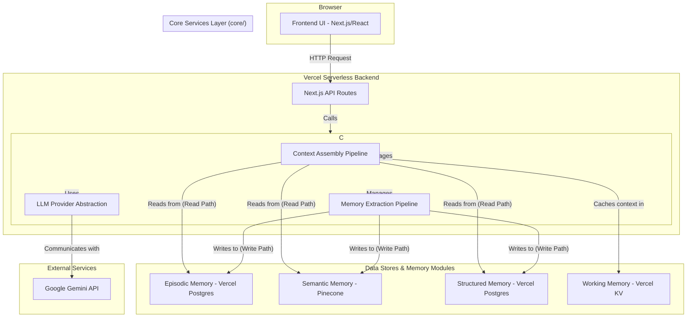

# HedraCore: The Definitive Developer's Guide

**Version:** 0.4.0
**Status:** Live (Reflects Cognitive Architecture v2.0)

---

## Table of Contents

1.  [Project Vision: The Total Recall Companion](#1-project-vision-the-total-recall-companion)
2.  [System Architecture](#2-system-architecture)
3.  [Technology Stack & Environment](#3-technology-stack--environment)
4.  [Project Structure Deep Dive](#4-project-structure-deep-dive)
5.  [Feature Registry & Hubs Deep Dive](#5-feature-registry--hubs-deep-dive)
6.  [Development Workflow & Rules](#6-development-workflow--rules)
7.  [Future Roadmap & Important Notes](#7-future-roadmap--important-notes)

---

## 1. Project Vision: The Total Recall Companion

**HedraCore** is a next-generation, AI-powered assistant built for a single power user. Its foundational principle is a persistent, intelligent, and multi-faceted memory. It functions as a true **Total Recall Companion**, actively learning from every interaction to become an indispensable partner for managing complex information and executing sophisticated workflows through a secure, cloud-native, and highly configurable platform.

---

## 2. System Architecture

HedraCore uses a modern, server-centric architecture where the frontend UI acts as a client to a powerful backend Core Engine. This ensures a clean separation of concerns and enhances security.

---

## 3. Technology Stack & Environment

- **Framework:** Next.js 14 (App Router)
- **Language:** TypeScript
- **Styling:** Tailwind CSS
- **UI & Animation:** React, Framer Motion
- **AI Model:** Google Gemini API (`@google/genai`)
- **Episodic & Structured Memory:** Vercel Postgres
- **Semantic Memory (Vectors):** Pinecone
- **Working Memory (Cache):** Vercel KV (Redis)
- **Deployment Platform:** Vercel

---

## 4. Project Structure Deep Dive

- **`/app`**: The core of the Next.js application.
  - **`/api`**: All backend API endpoints. These are lightweight wrappers that call the Core Engine.
- **`/components`**: All React UI components.
  - **`/providers`**: Global state management using React Context (`ConversationProvider`, `UIStateProvider`, etc.).
  - **`/dashboard`, `/agent_center`, `/brain_center`, etc.**: Components for the major UI hubs.
- **`/core`**: **The Cognitive Engine.** All decoupled, backend-only business logic resides here.
  - **`/llm`**: The LLM Provider Abstraction Layer, which decouples the application from any specific AI SDK.
  - **`/memory`**: All Single Memory Module (SMM) implementations (Episodic, Semantic, etc.).
  - **`/pipelines`**: The high-level orchestrators (`ContextAssemblyPipeline`, `MemoryExtractionPipeline`).
- **`/docs`**: Legacy documentation, interactive HTML reports (`/Res`), and feature proposals (`/Features-Demo`).
- **`/DocsV2`**: The current, most up-to-date architectural documentation files.
- **`/lib`**: Shared utilities, hooks, and global type definitions.
- **`/scripts`**: Standalone Node.js scripts for database management (`create-tables.js`, `seed-*.js`).
- **`PROJECT_GUIDE.md`**: This file. The single source of truth for all project documentation.

---

## 5. Feature Registry & Hubs Deep Dive

This section details all major user-facing hubs and their implemented features.

### 5.1. Dashboard Center (`/components/dashboard`)
The main landing page and high-level command center for the application.
- **Header Panel**: Displays the application's branding.
- **Hedra Goals Panel**: Manages and displays the project's strategic goals and subsystems.
- **Stats Panel**: Visualizes system-wide statistics with interactive charts powered by Nivo.
- **Documentation Panel**: Provides quick access to view and edit project documentation.
- **Actions, Decisions, Reports Panels**: Centralized locations for system-wide actions, user decisions, and generated reports.

### 5.2. Autonomous Agent Center (`/components/agent_center`)
A hub for defining high-level goals and launching autonomous agents to achieve them.
- **Goal Definition**: A UI for inputting complex, multi-step goals.
- **Plan Generation & Review**: The agent first generates a high-level plan, which the user must approve before execution.
- **Live Execution Report**: A real-time monitor showing the agent's thought process, actions, and observations for each step.
- **Run History**: A persistent list of all previous and ongoing agent runs.

### 5.3. Brain Center (`/components/brain_center`)
The central management hub for the AI's cognitive architecture.
- **Brain Management**: A full CRUD interface for creating and configuring different "Brains" (e.g., "Work Brain", "Personal Brain").
- **Memory Viewer**: An inspection tool to view the raw data within each memory module (Episodic, Semantic, Structured).

### 5.4. Memory Center (`/components/memory_center`)
Manages the AI's **Structured Memory** (explicit facts).
- **Entity Management**: A full CRUD interface for managing entities (people, projects, concepts) stored in the Postgres database.

### 5.5. Contacts Hub (`/components/ContactsHub.tsx`)
A specialized part of Structured Memory for managing people and organizations.
- **Contact Management**: A full CRUD interface for contacts.
- **@Mention Integration**: Contacts can be mentioned in the chat input to provide specific context to the AI.

### 5.6. Prompts Hub (`/components/PromptsHub.tsx`)
A system for creating, managing, and using reusable prompt templates.
- **Prompt Management**: A two-panel CRUD interface for organizing prompts into folders and tags.
- **Dynamic Variables**: Supports `{{variable}}` placeholders that trigger a modal for user input.
- **Workflow Builder**: A drag-and-drop UI to create multi-step prompt chains where the output of one step can be the input for another.

### 5.7. Tools Hub (`/components/ToolsHub.tsx`)
The interface for managing **Procedural Memory** (the agent's capabilities).
- **Tool Registry**: A CRUD interface to define tools the agent can use.
- **Schema Definition**: Each tool requires a JSON Schema that defines its inputs, which the agent uses to form correct function calls.
- **Status**: The backend and database infrastructure is complete. The UI is fully functional.

### 5.8. Tasks Hub (`/components/TasksHub.tsx`)
A simple task and to-do list manager.
- **Status**: The backend infrastructure (database table, API endpoints) and a full-featured UI are complete and functional.

### 5.9. Data Hub (`/components/data_hub`)
A dashboard for monitoring and managing all connected data sources and storage services.
- **Architecture**: Consists of a main center (`DataHubCenter.tsx`) with a tabbed interface for a `ServicesPanel` and `LogsPanel`. The `ServicesPanel` displays multiple `ServiceCard` components, each representing a data source, and is summarized by a `StatsRow`. A `DataHubWidget` provides a quick-view modal.
- **Status**: **Implemented.** The Data Hub is fully functional, fetching live data from the `data_sources` table via the `/api/data-sources` endpoints. It provides a real-time overview of all connected services, their status, and allows for configuration management through dedicated modals.

### 5.10. SoulyDev Center (`/components/dev_center`)
An integrated control panel for developers.
- **API Command Center**: A Postman-like interface to test all backend API endpoints directly in the app.
- **Feature Health Dashboard**: A QA hub to display the health status of all system features based on registered test cases.
- **Features Dictionary**: A full CRUD interface for managing the project's feature list.
- **Smart Documentation**: A live, editable viewer for project documentation.

---

## 6. Development Workflow & Rules

Adherence to these guidelines is **mandatory** for all development work.

1.  **Onboarding (Start of Session)**: Before any task, the agent **MUST** review this file (`PROJECT_GUIDE.md`) and key implementation files like `App.tsx` and `ConversationProvider.tsx` to understand the current project state.

2.  **Feature Management**:
    - **Proposal:** The user proposes a feature. The agent discusses requirements.
    - **Registration:** The feature **MUST** be added to the database via `scripts/seed-features.js` with a status of `⚪ Planned`.
    - **Approval:** The agent must wait for explicit user approval before implementation.

3.  **Implementation & Versioning**:
    - **Code:** The agent writes the code.
    - **Status Update:** The agent updates the feature's status in `scripts/seed-features.js` to `✅ Completed`.
    - **Versioning:** The agent increments the version in `package.json` and adds a new entry to `scripts/seed-version-history.js`.

4.  **Response Protocol**:
    - **Part 1 (Code):** The first response **MUST ONLY** contain the `<changes>` XML block.
    - **Part 2 (Report):** The agent then generates a new, sequentially numbered HTML report file (e.g., `Docs/Res/ResponseTemplate-X.html`) with a detailed explanation of the changes.

---

## 7. Future Roadmap & Important Notes

### Key Unimplemented Features:
- **Advanced Autonomous Agent (ReAct)**: The current agent executes a pre-defined plan. The next major step is to implement a true ReAct (Reason + Act) loop where the agent can choose and use tools from the **Tools Hub** to solve problems dynamically.
- **Communication Hub**: A major planned feature to turn the application into a central point for managing external communications via Webhooks and other channels.
- **UI/UX Enhancements**: Several planned UX improvements are pending implementation, including a `Cmd+K` Command Palette, a theming engine, and a global search function.

### Important Notes:
- The project is designed for a **single power user**. Features related to multi-tenancy, teams, or public sharing are out of scope.
- The project follows an **API-First** philosophy. All functionality should be exposed via a backend API, with the UI acting as a client.
- The project has a custom-built UI using **Tailwind CSS**. Integrating large, external component libraries like Flowbite or Mantine is strongly discouraged to maintain design consistency and avoid complexity. Instead, inspiration can be drawn from them to build new custom components.
