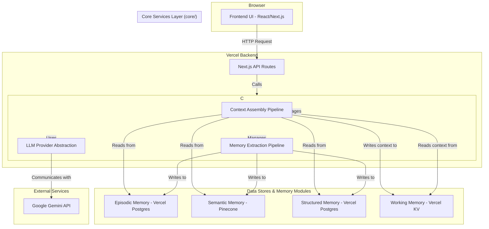

# SoulyCore Cognitive Architecture v2.0: Current System Architecture

**Document Version:** 1.1
**Status:** Implemented

---

### 1. High-Level Architecture Diagram

The v2 architecture introduces a dedicated `core/` services layer that decouples the frontend and API routes from the underlying memory and AI model logic. This promotes modularity, testability, and maintainability.

### 2. Major Data Flows

The system operates primarily through two opposing data flow pipelines, orchestrated by the Cognitive Engine.

#### 2.1. The Read Path: Context Assembly Pipeline

This flow is triggered when a user sends a message. Its purpose is to gather and assemble all necessary context for the AI model.

1.  **UI -> API:** The `ChatWindow` sends the user's message and `conversationId` to `POST /api/chat`.
2.  **API -> Core:** The API route invokes the `ContextAssemblyPipeline` within the Core Services Layer.
3.  **Core -> Memory Modules:** The pipeline executes a series of parallel reads:
    *   Queries Vercel Postgres for recent messages (**Episodic Memory**).
    *   Queries Pinecone for relevant knowledge chunks (**Semantic Memory**).
    *   Queries Vercel Postgres for mentioned entities/contacts (**Structured Memory**).
4.  **Core -> LLM:** The final, context-rich prompt is sent via the `LLM Provider Abstraction` to the Gemini API.
5.  **Response -> UI:** The AI's response is streamed back through the layers to the user's screen.

#### 2.2. The Write Path: Memory Extraction Pipeline

This flow is triggered asynchronously after a successful conversation turn. Its purpose is to learn from the interaction.

1.  **API -> Core (Async):** The `addMessage` flow in the frontend, after receiving the AI response, triggers a fire-and-forget call to `POST /api/memory/pipeline`.
2.  **API -> Core:** The API route invokes the `MemoryExtractionPipeline`.
3.  **Core -> LLM:** The pipeline sends the conversation turn to the Gemini API with instructions focused on extraction and analysis.
4.  **Core -> Memory Modules:** The extracted data from the LLM is processed and written to the appropriate long-term memory stores:
    *   New/updated facts are embedded and upserted into Pinecone (**Semantic Memory**).
    *   New/updated entities are saved to Vercel Postgres (**Structured Memory**).
    *   The conversation turn itself is already saved as part of the chat flow (**Episodic Memory**).
